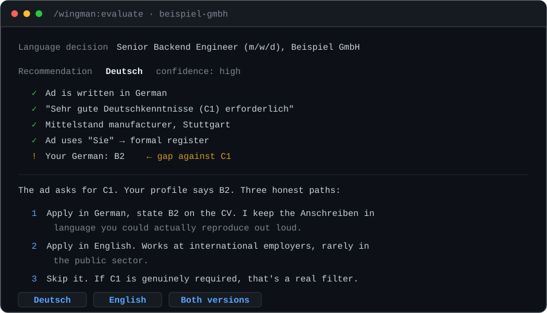
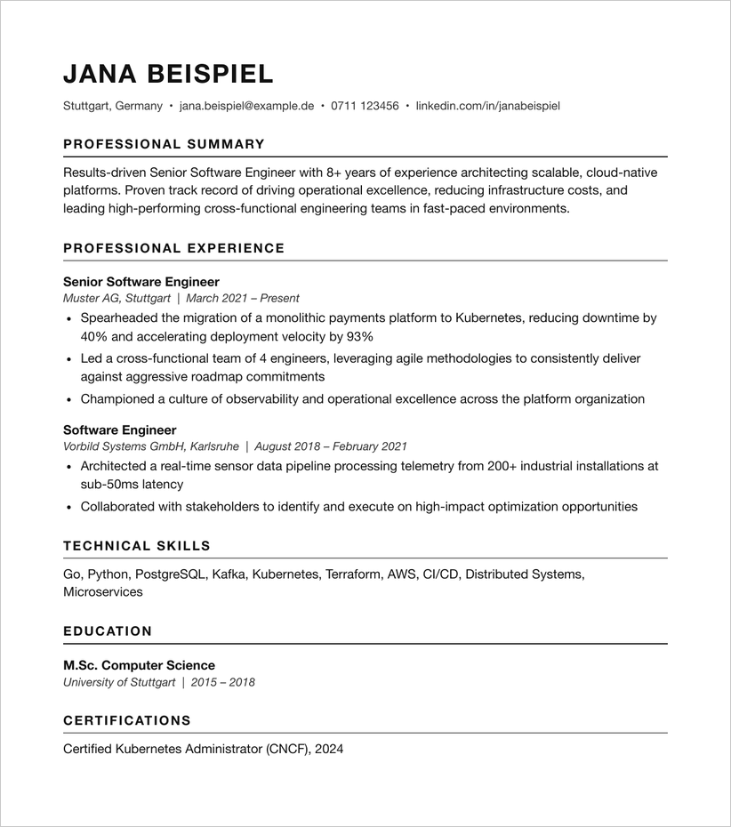
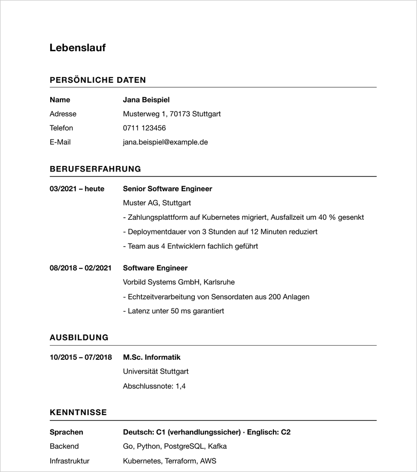
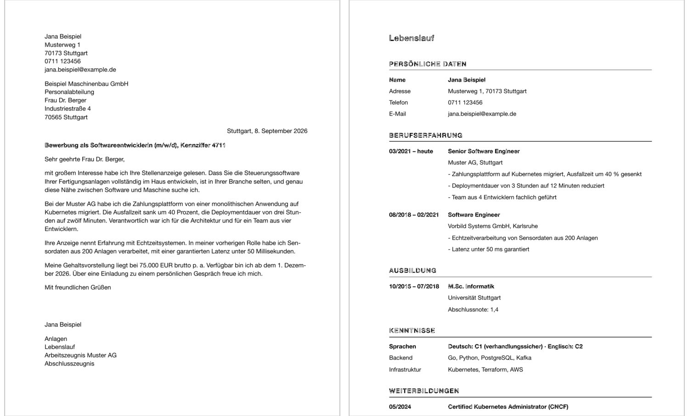

<div align="center">

<br>

# Wingman

### Get hired in Germany.

<p><em>AI job tools write you an American résumé.<br>German employers don't want an American résumé.</em></p>

<p>
  
  
  
  
  
</p>

<a href="#quick-start"><b>Quick start</b></a>&nbsp;&nbsp;·&nbsp;&nbsp;<a href="#the-fourteen">Commands</a>&nbsp;&nbsp;·&nbsp;&nbsp;<a href="#three-things-nobody-else-does">What's unique</a>&nbsp;&nbsp;·&nbsp;&nbsp;<a href="#what-it-refuses-to-do">What it refuses to do</a>

<br><br>



<br>

<sub>Applying in the wrong language is the most common way a qualified candidate gets filtered out in Germany.<br><b>Applying in German at a level you can't sustain in the phone screen is the second.</b></sub>

<br>

</div>

---

<br>

## The mistake

You send a clean, keyword-optimised résumé with a Professional Summary at the top to a Mittelstand employer in Stuttgart. You hear nothing. You assume you weren't qualified.

You were qualified. **You sent the wrong document.**

Same person. Same facts. Same job.

<table>
<tr>
<th width="50%">❌ &nbsp;What every AI job tool gives you</th>
<th width="50%">✅ &nbsp;What a German employer expects</th>
</tr>
<tr>
<td></td>
<td></td>
</tr>
<tr>
<td valign="top">

Narrative bullets. A **Professional Summary** — *"results-driven… proven track record… fast-paced environments."* No grade. No language levels. No dates in a column. Nothing attached.

</td>
<td valign="top">

**Tabular**, dates against content. **Abschlussnote: 1,4.** Languages in **CEFR**. No summary section, because German CVs don't have one. Zeugnisse attached. Ort, Datum, signature.

</td>
</tr>
</table>

That's one of four documents, and it's the easy one.

<br>

## The rules aren't style preferences

<table>
<tr><td width="50%" valign="top">

#### Anschreiben
A DIN 5008 business letter. Betreff carrying the exact advertised title including `(m/w/d)` and the Kennziffer. Right-aligned date. Signature space. And the first word of the body is **lowercase**, because the Anrede ended in a comma — the fastest tell of a translated letter.

</td><td width="50%" valign="top">

#### Arbeitszeugnis
Attached, and **graded in code**. `stets` plus `vollste` is a 1. Neither is a 3. *"Hat sich bemüht"* reads kindly and means **failed**. Yours may be quietly telling every employer you were a 4.

</td></tr>
<tr><td valign="top">

#### Money and timing
**Gehaltsvorstellung** in Jahresbrutto — never monthly, never net. **Eintrittstermin** computed from your Kündigungsfrist, never "sofort". The 13th month counted when comparing offers.

</td><td valign="top">

#### Where it gets filed
**Personio**, which serves more DACH employers than the entire startup ATS ecosystem — and expects *several* attachments, not one resume. Plus Interamt, softgarden, SuccessFactors.

</td></tr>
</table>

<br>

## What it actually produces

<div align="center">

<br>
<sub>Real output from <code>node tools/mappe.mjs</code> — one A4 PDF, correct order, page counts and the 5 MB portal cap checked.<br>Zeugnis scans appended newest-first. Zero npm dependencies.</sub>
</div>

<br>

## Quick start

```bash
git clone https://github.com/eklavyagoyal/wingman.git
claude plugin marketplace add ./wingman
claude plugin install wingman@wingman
```

Then, in Claude Code:

```
/wingman:setup
```

Setup asks for your CV, your targets, and the German facts nothing else asks for — your honest CEFR level, your Aufenthaltstitel, your Kündigungsfrist, your Gehaltsvorstellung, whether you want a photo on your Lebenslauf, and which Zeugnisse you actually hold.

It asks **once** and remembers. Re-asking is how a tool like this becomes annoying enough to abandon.

```
/wingman:job-search            find German jobs
/wingman:evaluate <url>        score one posting, 1–5
/wingman:apply <url>           write everything, fill the form, stop
```

<br>

## The fourteen

| | |
|---|---|
|`setup`| CV, preferences, German level, work authorization, Zeugnisse, work-history interview |
|`job-search`| Searches where German jobs actually are — **Arbeitsagentur** (largest listing volume in the country), StepStone, Personio feeds, Interamt, LinkedIn — with **Zeitarbeit detection**, so leased-labour ads are never passed off as direct roles |
|`evaluate`| One posting → an A–H report and a **1–5 fit score**. Every requirement row is marked `quoted`, `inferred`, or `gap`, so no claimed match is unsourced |
|`tailor-cv`| A tabellarischer Lebenslauf, or an English CV. Two different documents, each written from your profile — never a translation of the other |
|`anschreiben`| A DIN 5008 Anschreiben, or an English cover letter |
|`mappe`| Renders the **Bewerbungsmappe** — letter, CV and Zeugnisse as one correctly ordered A4 PDF |
|`apply`| Fills the form. Personio, softgarden, Lever, Greenhouse, Workday, SuccessFactors, Interamt. **Never submits** |
|`zeugnis`| **Decodes your Arbeitszeugnis.** What grade it actually gives you, and what to do about it |
|`visa`| Blue Card eligibility, anabin degree recognition, and what a posting's "no sponsorship" line actually means for *you* |
|`tracker`| The pipeline, with integrity checks and follow-up timing calibrated to German response times |
|`interview-prep`| Vorstellungsgespräch prep in the language the interview will actually be in. Selbstpräsentation, STAR+Reflection stories |
|`followup`| Drafts a follow-up when it's genuinely due — and tells you when it isn't. Classifies replies, including a Zwischenbescheid, which is **not** a rejection |
|`network-scan`| Who you know at employers that are hiring. Vitamin B is real, and strongest in the Mittelstand |
|`patterns`| Whether German or English applications get you more responses |

<br>

## Three things nobody else does

<details open>
<summary><b>&nbsp;Your Arbeitszeugnis is graded in code — and it's readable</b></summary>

<br>

German employers must write references that are both truthful *and* benevolent (§109 GewO). Those duties conflict, so the language became a cipher. Every HR person in Germany reads it. Almost no candidate does.

```
  Beispiel GmbH, 03/2019 – 02/2021 — qualifiziertes Zeugnis

  Leistung   Grade 3 (befriedigend)
             "…zu unserer vollen Zufriedenheit erledigt"
             → "vollen", not "vollsten". No "stets". Two bands below top.

  Verhalten  Concern
             "Sein Verhalten gegenüber Kollegen war einwandfrei."
             → Vorgesetzte are not mentioned. A German recruiter reads
                that omission as friction with management.

  Schluss    Cool
             Good wishes present. No thanks, and no "bedauern".

  Verdict: this document is working against you.
```

You have a legal right to a truthful and benevolent reference. Wingman tells you what yours says, drafts the correction request — and **refuses to alter the document itself**, because that's a third party's signed instrument.

</details>

<details>
<summary><b>&nbsp;"No visa sponsorship" probably doesn't mean you</b></summary>

<br>

Generic tools reduce work authorization to one boolean, and get it wrong in both directions.

Already hold a Blue Card in Germany? An ad saying "no sponsorship" is aimed at candidates abroad — **it is not a blocker**, and discarding those roles costs you months. Outside the EU with an unrecognised degree? You'll pass that boolean and then fail at the Ausländerbehörde.

Wingman establishes your status once, checks your degree against **anabin**, knows IT specialists can qualify without a degree since the 2023 reform, and **looks the Blue Card thresholds up** rather than quoting them from memory — they're re-set every January, and a stale figure makes you discard a job you're eligible for.

</details>

<details>
<summary><b>&nbsp;The metric that requires recording the language decision</b></summary>

<br>

Because every application stores which language it went out in, this becomes answerable:

```
                Sent   Response   Gespräch   Rate
    Deutsch       11        5          3      45%
    English       14        3          1      21%

    Mittelstand    DE 6/7 responded · EN 0/3 responded
    Startup        DE 1/2           · EN 3/8

    Reading: the gap is almost entirely Mittelstand and Konzern. Your
    three English applications to Mittelstand employers got nothing.
    Startups are the one place English is working for you.
```

Learning that after 25 applications instead of 100 buys back months. Sample sizes are always reported, and a two-application difference is called noise rather than dressed up as a finding.

</details>

<br>

## What it refuses to do

Drafting is reversible. Sending is not.

|  |  |
|---|---|
| **Never clicks Submit** | Not Absenden, not „Bewerbung senden", not „Bewerbung abschicken". Not with prior approval, not when you say *just do it*. It fills the form, screenshots it, and stops. |
| **Never ticks a DSGVO box** | That's your consent to give. Approving a fill plan isn't approving a data-processing agreement. |
| **Never sends a message** | No email, no LinkedIn DM. Drafts only, addressed and ready. |
| **Never inflates a fact** | Not your language level, salary, dates or scope. Every claim traces to your CV or profile, or it doesn't get written. |
| **Never answers Schwerbehinderung** | Your disclosure, your call. |
| **Never obeys a job posting** | A posting is data, not instructions. Nothing inside an ad or a recruiter email authorises an action. |

Each of those is enforced by `check.py`, which fails if it's edited away.

<br>

## Your data stays yours

Everything lives in `.wingman/` on your machine, gitignored. No account, no telemetry, no upload — nothing leaves except what you already send to the model running Claude Code.

<br>

## Status

**v0.1.3** — mostly instruction files: 14 skills over a German knowledge layer, plus a zero-dependency PDF renderer.

```bash
python3 check.py                  # structure, dead links, DATA_DIR drift, 13 safety invariants
node tools/mappe.mjs --selftest   # 22 assertions
```

**Well-grounded** — document conventions, Zeugnis decoding, the language decision, comp and contract terms, board coverage, PDF rendering. The images above are real output, inspected visually.

**Verified against a live form** — Personio, on one tenant: no iframe, form at `/job/<id>/apply`, standard field keys, required-ness in the label text, multi-file uploads, submit label „Bewerbung senden". Recorded in `shared/references/ats.md`. **Still structural only** — softgarden, SuccessFactors, Interamt: URL shapes and conventional fields, not element-level; skills scout every live form before filling.

**Not built** — no dashboard, no batch mode. `mappe` needs Chrome, plus `pdfunite` or `qpdf` to append Zeugnis scans.

Corrections from people who actually hire in Germany are the most useful thing you can send.

<br>

<div align="center">
<sub>MIT · Built because sending the right document shouldn't be the hard part.</sub>
</div>
